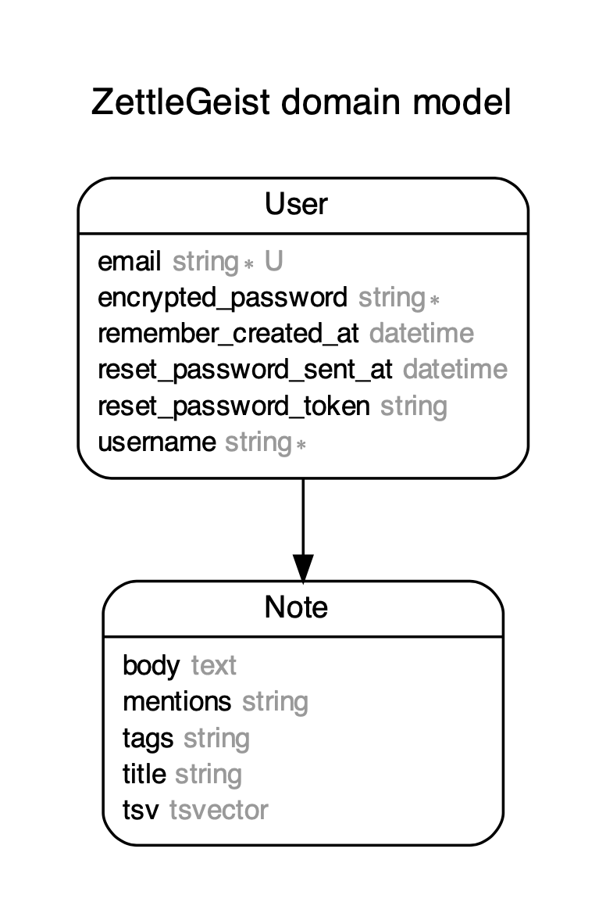

# ZettelGeist

A handy web-application for creating and maintaining notes

- Ruby version:

  - `ruby 3.0.0p0`

- Rails version:

  - `Rails 6.1.1`

- System dependencies:

  - PostgreSQL `postgres (PostgreSQL) 13.1`

- Steps to run the Application:

  - `bundle install`
  - `rails db:migrate`
  - `rails server`
  - `localhost:3000`

- Database design:

  
